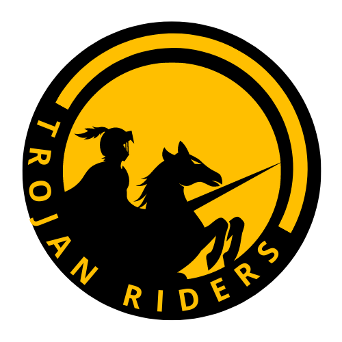
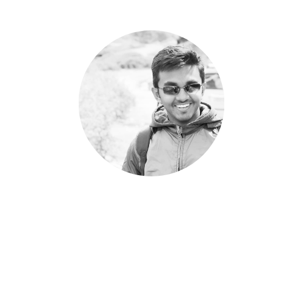

<!DOCTYPE html>
<html lang="en">
<head>
    <meta charset="UTF-8">
    <meta http-equiv="X-UA-Compatible" content="IE=edge">
    <meta name="viewport" content="width=device-width, initial-scale=1.0">
    <title>Document</title>
</head>
<body>
    Hi
</body>
</html>
<!--

    

    About Us

    Trojan Riders is a Hackathon Team of people who are inexperienced in Hackathons. They have participated in only Hackathon so far and made it to the top 20 teams.  
    They are always learning and looking forward for the next Challenge.

    Team

    

        
    

    

        
    

    

        
    

    

        
    

    Hackathon and Results

-->